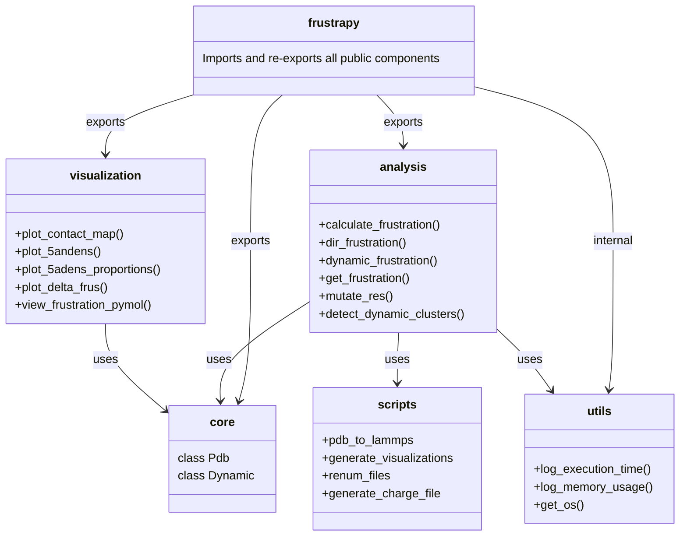

# FrustraPy: A Python Implementation of the Protein Frustratometer

[](https://colab.research.google.com/github/engelberger/frustrapy/blob/main/FrustraPy_colab.ipynb)

FrustraPy is an attempt at a parallelized Python implementation of the [frustratometeR package](https://github.com/proteinphysiologylab/frustratometeR) (See publications by [Parra et al.](https://academic.oup.com/nar/article/44/W1/W356/2499321) , [Rausch et al.](https://academic.oup.com/bioinformatics/article/37/18/3038/6171179) [Jenik et al.](https://academic.oup.com/nar/article/40/W1/W348/1075768)), designed for analyzing energetic frustration in protein structures. This implementation offers significant enhancements including interactive visualizations, parallel processing capabilities, and various performance optimizations.

⚠️ **Disclaimer**: This is an unofficial reimplementation. Use at your own risk and verify results against the original FrustratometeR when possible.

## Key Features

### Analysis Capabilities
- **Multiple Frustration Analysis Modes**:
  - Configurational frustration
  - Mutational frustration
  - Single residue frustration
- **Enhanced Mutation Analysis**:
  - Parallel execution of mutations
  - Customizable mutation schemes

### Performance Optimizations
- **Parallel Processing**:
  - Multi-core support for mutation analysis
  - Optimized memory usage
- **Progress Tracking**:
  - Real-time progress bars using tqdm
  - Execution time logging
  - Memory usage monitoring

### Visualization Suite
- **Interactive Plots**:
  - Frustration density plots
  - Mutation analysis visualizations


## Installation

```bash
# Basic installation
pip install frustrapy

# Development installation
git clone https://github.com/engelberger/frustrapy.git
cd frustrapy
pip install -r requirements.txt
pip install -e ".[dev]"
```

## Examples

### Basic Usage

```python
import frustrapy

# Simple configurational frustration analysis
pdb, plots = frustrapy.calculate_frustration(
    pdb_file="protein.pdb",
    mode="configurational",
    results_dir="results"
)

# Access and display results
plots.show_contact_map()
plots.save_all_figures("output_directory")
```

### Advanced Usage with Performance Profiling

```python
from frustrapy import Profiler

# Initialize profiler
profiler = Profiler()
profiler.start_section("Total Analysis")

# Configure analysis parameters
residues_to_analyze = {"A": [144, 146]}
results_dir = "results_example"

# Analyze multiple PDBs in a directory
profiler.start_section("Directory Analysis")
plots_dir_dict = frustrapy.dir_frustration(
    pdbs_dir="pdbs_directory",
    mode="singleresidue",
    results_dir=results_dir,
    debug=True,
    chain="A",
    residues=residues_to_analyze
)
profiler.end_section("Directory Analysis")

# Single PDB detailed analysis
profiler.start_section("Single PDB Analysis")
pdb, plots = frustrapy.calculate_frustration(
    pdb_file="example.pdb",
    mode="singleresidue",
    results_dir=results_dir,
    chain="A",
    residues=residues_to_analyze
)
profiler.end_section("Single PDB Analysis")

# Print performance report
profiler.end_section("Total Analysis")
profiler.print_report()
```

### Analyzing Results

```python
import pickle
import os

# Load and analyze results
results_dir = "results_example"
for root, dirs, files in os.walk(results_dir):
    for file in files:
        if file.endswith("_single_residue_data.pkl"):
            with open(os.path.join(root, file), "rb") as f:
                data = pickle.load(f)
                
            # Access chain A data
            if "A" in data:
                for res_num in [144, 146]:
                    if res_num in data["A"]:
                        res_data = data["A"][res_num]
                        mutations = res_data.mutations
                        
                        # Find extreme mutations
                        most_frustrated = min(mutations.items(), key=lambda x: x[1])
                        least_frustrated = max(mutations.items(), key=lambda x: x[1])
                        
                        print(f"\nPosition {res_num} Analysis:")
                        print(f"Most frustrated: {most_frustrated}")
                        print(f"Least frustrated: {least_frustrated}")
```

## Package Structure

```
frustrapy/
├── __init__.py           # Main package entry point
├── core/                 # Core functionality
│   ├── __init__.py
│   ├── pdb.py           # PDB structure handling
│   └── dynamic.py       # Dynamic analysis core
├── analysis/            # Analysis modules
│   ├── __init__.py
│   ├── frustration.py   # Frustration calculations
│   ├── mutations.py     # Mutation analysis
│   └── clustering.py    # Clustering algorithms
├── visualization/       # Visualization tools
│   ├── __init__.py
│   ├── plots.py        # Plotting functions
│   └── structure.py    # PyMOL visualization
├── utils/              # Utility functions
│   ├── __init__.py
│   ├── decorators.py   # Performance decorators
│   └── helpers.py      # Helper functions
└── scripts/            # External tools integration
    ├── __init__.py
    ├── pdb_to_lammps.py
    └── visualization_tools.py
```

## Class Diagram



## Contributing

Contributions are welcome! Please read our [Contributing Guidelines](CONTRIBUTING.md) for details on our code of conduct and the process for submitting pull requests.

## Citation

If you use FrustraPy in your research, please cite the following papers:

```bibtex
@article{parra2016protein,
  title={Protein Frustratometer 2: a tool to localize energetic frustration in protein molecules, now with electrostatics},
  author={Parra, R Gonzalo and Schafer, Nicholas P and Radusky, Leandro G and Tsai, Min-Yeh and Guzovsky, A Brenda and Wolynes, Peter G and Ferreiro, Diego U},
  journal={Nucleic acids research},
  volume={44},
  number={W1},
  pages={W356--W360},
  year={2016},
  publisher={Oxford University Press}
}
@article{jenik2012protein,
  title={Protein frustratometer: a tool to localize energetic frustration in protein molecules},
  author={Jenik, Michael and Parra, R Gonzalo and Radusky, Leandro G and Turjanski, Adrian and Wolynes, Peter G and Ferreiro, Diego U},
  journal={Nucleic acids research},
  volume={40},
  number={W1},
  pages={W348--W351},
  year={2012},
  publisher={Oxford University Press}
}
@article{rausch2021frustratometer,
  title={FrustratometeR: an R-package to compute local frustration in protein structures, point mutants and MD simulations},
  author={Rausch, Atilio O and Freiberger, Maria I and Leonetti, Cesar O and Luna, Diego M and Radusky, Leandro G and Wolynes, Peter G and Ferreiro, Diego U and Parra, R Gonzalo},
  journal={Bioinformatics},
  volume={37},
  number={18},
  pages={3038--3040},
  year={2021},
  publisher={Oxford University Press}
}
```

## License

This project is licensed under the MIT License - see the [LICENSE](LICENSE) file for details.

## Acknowledgments

- Original Frustratometer developers!
